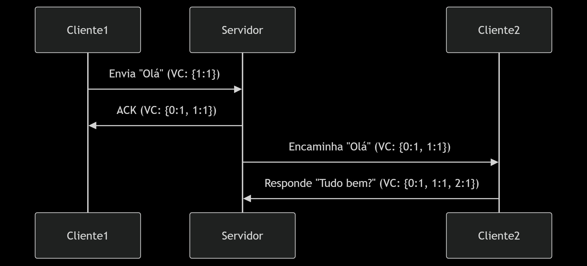
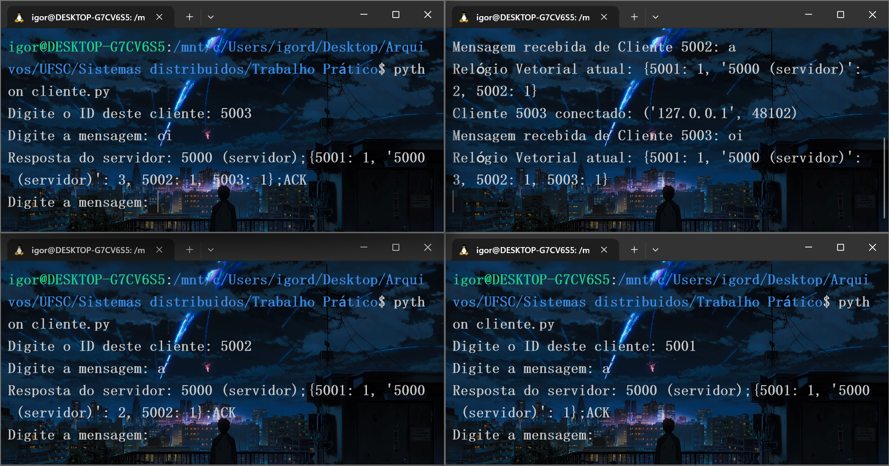

# Relógios Vetoriais em Sistemas Distribuídos

## Descrição
Implementação de um sistema cliente-servidor em Python que demonstra o uso de **relógios vetoriais** para ordenação causal de eventos em sistemas distribuídos. O servidor coordena a troca de mensagens entre múltiplos clientes, garantindo que a relação "aconteceu-antes" (`happened-before`) seja preservada.

## Requisitos
- **Sistema Operacional**: Linux, Windows ou macOS
- **Python**: 3.12.3 ou superior
- **Bibliotecas**:
  ```bash
  socket    # Comunicação em rede
  threading # Concorrência
  collections # Dicionários padrão

## Como instalar as dependências
** No Linux (Debian/Ubuntu): **
sudo apt update && sudo apt install python3

** No Windows: **
Baixe o instalador em https://www.python.org/downloads/

## Como funciona?
- Comunicação de cliente servidor:
    

    ```markdown
    Cada mensagem inclui o relógio vetorial (VC) do emissor.

    O servidor atualiza seu VC comparando os valores recebidos com os locais (usando max).

    O VC resultante é enviado de volta aos clientes para sincronização.

- Como o serviço é executado no servidor?
    O servidor mantém um relógio vetorial global (ex: {0: 3, 1: 2} onde 0 é o servidor).

        * Para cada mensagem recebida:

        * Incrementa seu próprio contador.

        * Atualiza os contadores dos outros processos com os valores máximos.

        * Exibe a mensagem e o VC atualizado no terminal/GUI.

- Demonstração da recepção e envio de mensagens:
    

    ```markdown
    Blocos de código relevante:

    *Cliente (envio)*
    self.vector_clock[self.process_id] += 1
    data = f"{self.process_id};{dict(self.vector_clock)};{message}"

    *Servidor (atualização do vc)*
    for pid in received_vc:
        self.vector_clock[pid] = max(self.vector_clock[pid], received_vc[pid])

## Como executar
1. **Servidor**:
   ```bash
   python server.py

   Saida esperada:
   ```bash
   Servidor ouvindo em localhost:5000

2. **Cliente**:
   ```bash
   python cliente.py
   (`abra varios`)

   - Digite um ID único para cada cliente (ex: 1, 2).
   - Envie mensagens via prompt.

   *Exemplo de uso*
   ```bash
   (Cliente 1) Digite a mensagem: Olá!
   (Servidor) Mensagem recebida de Cliente 1: "Olá!" | VC: {0:1, 1:1}


---
